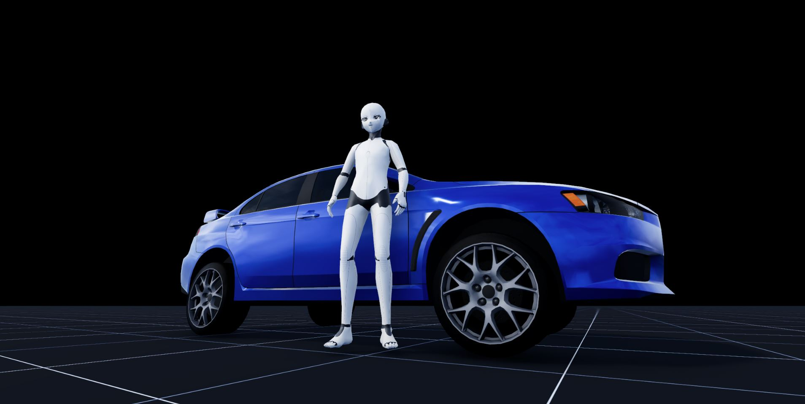
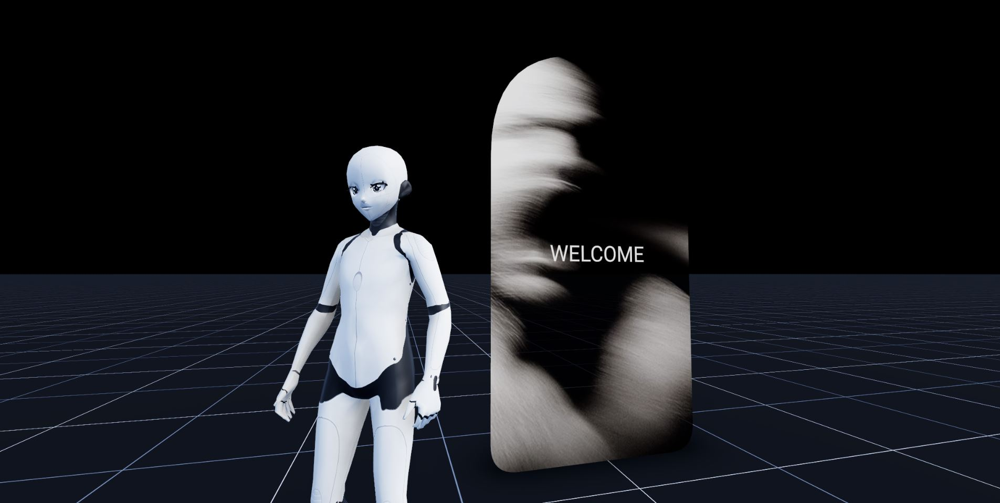
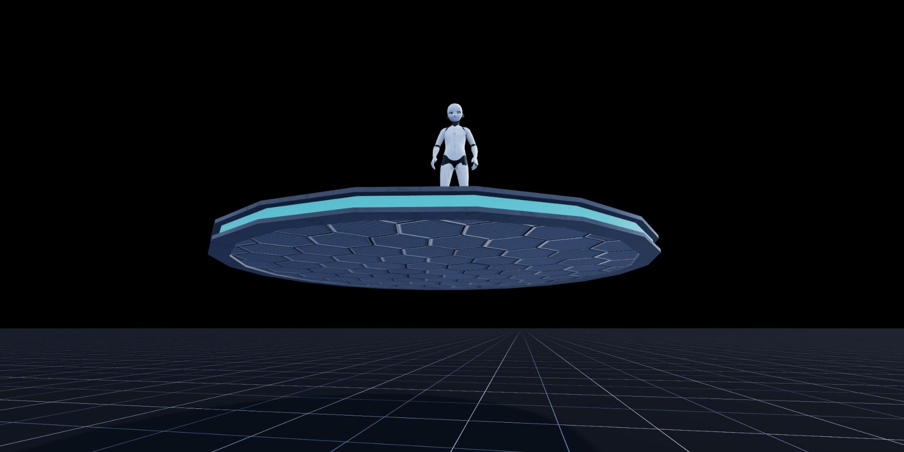
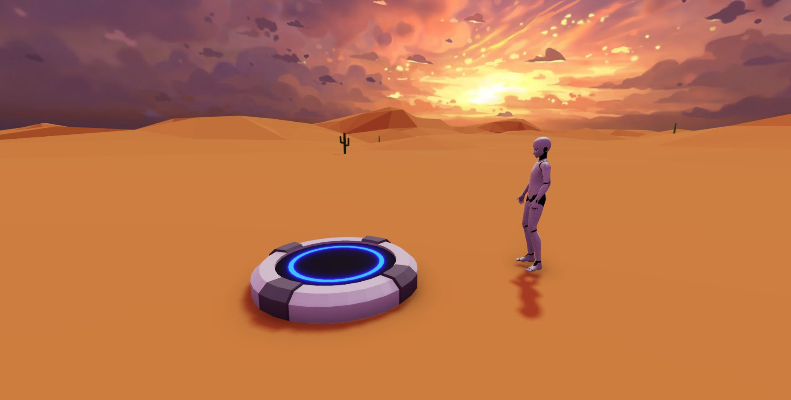

# Objects

## Car

### Overview

The car app allows you to create and configure cars in your virtual world. It provides extensive customization options, including body specifications, wheel configurations, engine dynamics, and more, to simulate realistic or fantastical vehicle behavior.

### Configuration Parameters

#### General

- **Position**: The `X`, `Y`, `Z` values for the world position of the app.
- **Rotation**: The `X`, `Y`, `Z` values for the world rotation of the app.
- **Label**: Custom label for vehicle.
- **Prefab**: Allows you to select a vehicle prefab with default settings. Options include `Drift`, `Offroad`, `GoKart` and `Custom`.
- **Reset Time**: The time (in seconds) before and idle vehicle respawns to its origin.
- **On Enter**: Action to take when a user enters the vehicle.
- **On Exit**: Action to take when a user exits the vehicle.

If you select a `Custom` vehicle:

#### Body

- **Model**: Allows you to upload a `.glb` model for your vehicle.
- **Size**: Sets the dimensions of the vehicle in the virtual world.
- **Center Of Mass**: Adjusts the vehicle's center of mass to affect its stability and handling.
- **Drag**: Defines the air resistance the vehicle experiences when moving.
- **Angular Drag**: Determines the vehicle's resistance to changes in rotational motion.
- **Acceleration**: Controls how quickly the vehicle can increase its speed.
- **Deceleration**: Sets how fast the vehicle slows down when not accelerating.
- **Brake Force**: Adjusts the effectiveness of the vehicle's braking system.
- **Max Speed**: Limits the vehicle's maximum speed.
- **Power Curve**: Influences how the vehicle's power output changes with speed.
- **Turn Speed**: Adjusts the speed at which the vehicle can turn.
- **Turn Angle**: Sets the maximum angle the vehicle can turn.
- **Turn Curve**: Modifies how the turn speed changes with the steering angle.
- **Anti-roll**: Helps to prevent the vehicle from rolling over during sharp turns.
- **Forward Slip**: Controls the amount of slip the vehicle's tires can have before losing traction.
- **Mode**: Selects the vehicle's drive type (`FWD`, `RWD`, `4WD`).
- **Engine Sound**: `Yes` to enable engine sound effects, `No` to disable engine sound effects.

#### Front Wheels

- **Axle Z**: Adjusts the position of the front axle along the vehicle's longitudinal axis, affecting the vehicle's balance and handling characteristics.
- **Axle Y**: Sets the height of the front axle relative to the vehicle's body, influencing ground clearance and center of mass.
- **Axle Width**: Determines the distance between the left and right front wheels, affecting vehicle stability and cornering performance.
- **Spring Length**: Specifies the length of the suspension springs, impacting how the vehicle absorbs shocks from the road surface.
- **Spring Strength**: Controls the stiffness of the suspension springs, influencing how the vehicle responds to bumps and how much it leans during cornering.
- **Spring Damper**: Adjusts the damping rate of the suspension, affecting how quickly the vehicle settles after being disturbed by road irregularities.
- **Tire Radius**: Sets the radius of the front tires, influencing the vehicle's ground clearance and how it interacts with various terrains.
- **Grip Curve**: Modifies the relationship between tire slip and grip, allowing for customization of how the vehicle's tires adhere to the road surface under different conditions.
- **H-brake**: `Yes` enables the handbrake functionality for the front wheels, affecting the vehicle's ability to perform sharp turns or drifts by locking the rear wheels. `No` disables this.

#### Back Wheels

The parameter definitions are identical to the Front Wheels section, except applied to the back wheels.

#### Emotes

- **Driver**: Allows you to upload a custom `.glb` emote for the driver.
- **Passenger**: Allows you to upload a custom `.glb` emote for the passenger.

#### Seat #1 (Driver)

- **Enabled**: `Yes` enables the driver's seat, `No` disables it. Disabling it might be used in scenarios where the vehicle is intended to be autonomous or controlled remotely.
- **Position `X`**: Adjusts the lateral position of the driver's seat within the vehicle.
- **Position `Y`**: Sets the vertical position of the driver's seat.
- **Position `Z`**: Controls the longitudinal position of the driver's seat.
- **Rotation**: Rotates the driver's seat around the vertical axis.

#### Seat #2

Uses same parameters as Seat #1

#### Seat #3

Uses same parameters as Seat #1

#### Seat #4

Uses same parameters as Seat #1

## Portal

### Overview

The portal app allows you to deploy a portal to other Hyperfy virtual worlds or external URLs.

### Configuration Parameters

#### General

- **Position**: The `X`, `Y`, `Z` values for the world position of the app.
- **Rotation**: The `X`, `Y`, `Z` values for the world rotation of the app.
- **URL**: The URL for the portal to link to.
- **Name**: A name label that displays on the portal.
- **Intensity**: Allows you to upload a `.jpg` or `.png` to display on the portal.
- **Text Color**: The color of the sun using hexadecimal value. This parameter has a color selector.
- **Tab**:`Current` to open the linked URL in the user's current browser tab, `New` to open the linked URL in a new tab.
- **Action**: `Click` to open the linked URL when a user clicks the portal, `Enter` to open the linked URL when a user enters the portal.

## Platform

### Overview

The Platform App allows for the creation and configuration of movable platforms within the virtual environment, enabling dynamic interactions and animations for user experiences.

### Configuration Parameters

#### General

- **Position**: The `X`, `Y`, `Z` values for the world position of the app.
- **Rotation**: The `X`, `Y`, `Z` values for the world rotation of the app.
- **Model**: Allows you to upload a `.glb` model for your platform.
- **Scale**: Sets the size of the platform relative to its original dimensions.
- **Collision**: Collision type used for mode (`None` applies no collision, `Inherit` inherits colliders from the `.glb` file, `All` applies collision to the entire model).

#### Timing

- **Travel**: The duration it takes for the platform to move from its start to its end position.
- **Easing**: Defines the acceleration curve of the platform's movement, influencing how the speed changes over time. `Linear` to move linearly, `QuadInOut` to use quadratic easing.
- **Pause**: The length of time the platform remains stationary at the end points before moving again.
- **Offset**: Delays the start of the platform's movement, allowing for synchronization with other elements.

#### Start

- **Position**: The platform's start position relative to the local origin.
- **Rotation**: The platform's starting rotation relative to the local origin.

#### End

- **Position**: The platform's end position relative to the local origin.
- **Rotation**: The platform's ending rotation relative to the local origin.

## Avatar

### Overview

The Avatar App enables users to equip custom VRM avatars within the virtual world.

### Configuration Parameters

#### General

- **Position**: The `X`, `Y`, `Z` values for the world position of the app.
- **Rotation**: The `X`, `Y`, `Z` values for the world rotation of the app.
- **Model**: Allows you to upload a `.vrm` avatar.
- **Emote**: Allows you to upload a custom `.glb` animation for your avatar.
- **Collectable**: `Yes` if the avatar is a digital collectible and is not intended for use outside of your world, `No` if the avatar can be used outside of your world.
- **Display**: `Model` to display the `.vrm` model, `Image` to display an image.

If `Image` is selected:

- **Image**: Allows you to upload a `.jpg`, `.png` or `.gif` to display instead of an avatar.
- **Width**: Width of the image. `Auto` keeps the width proportional to the height of the image.
- **Height**: Height of image.

## Mirror

### Overview

The Mirror App allows you to implement a mirror in your virtual world.

### Configuration Parameters

#### General

- **Position**: The `X`, `Y`, `Z` values for the world position of the app.
- **Rotation**: The `X`, `Y`, `Z` values for the world rotation of the app.
- **Width**: Sets the width of the mirror.
- **Height**: Adjusts the height of the mirror.

#### Buttons

- **Enabled**: `Yes` to display interactive buttons on the mirror, `No` to hide buttons.
- **Theme**: `Light` applies a light theme to the mirror's interface.`Dark` uses a dark theme for the mirror's interface.
- **Position**: Determines the placement of the buttons on the mirror.
- **Scale**: Adjusts the overall size of the buttons.

#### HD

- **Resolution**: The resolution of the mirror when `HD` mode is selected.
- **Display**: `Everything` to display everything in your world, `Backdrop` to only display avatars and a custom backdrop.
- **Image**: Allows you to upload a custom backdrop `.jpg` image.

#### SD

- **Resolution**: The resolution of the mirror when `SD` mode is selected.
- **Display**: `Everything` to display everything in your world, `Backdrop` to only display avatars and a custom backdrop.
- **Image**: Allows you to upload a custom backdrop `.jpg` image.

## Launch Pad

### Overview

The Launch Pad App allows you to create interactive launch pads within the virtual environment, propelling players into the air when they step onto the pad.

### Configuration Parameters

#### General

- **Position**: The `X`, `Y`, `Z` values for the world position of the app.
- **Rotation**: The `X`, `Y`, `Z` values for the world rotation of the app.
- **Type**: Allows you to select from a set of prefab models or create a `Custom` Launch Pad.

If you set your type to `Custom`:

- **GLB**: Allows you to upload a custom `.glb` model for the pad.
- **Collision**: Collision type used for mode (`None` applies no collision, `Inherit` inherits colliders from the `.glb` file, `All` applies collision to the entire model).
- **Animation**: Select the animation/s from the `.glb` file to use with the model.
- **Animate**: `Always` to auto-play the animation on loop, `On Enter` to play the animation when a user enters the Launch Pad area.
- **Hitbox**: Allows you to set the dimensions of the hitbox that triggers the launch behavior.
- **Hitbox Offset**: Allows you to offset the distance between the hitbox and the model.
- **Sound**: Allows you to upload an `.mp3` audio file associated with the Launch Pad.
- **Play Sound**: `Always` to auto-play the sound on loop, `On Enter` to play the sound when a user enters the Launch Pad area.

#### Behavior

- **Force**: The launch force applied to the user when entering the launch pad area.
- **On Enter**: Action to take when a user enters the launch pad area.

## Grabbable

### Overview

The Grabbable app allows a user to attach a custom model to the player avatar when it is _grabbed_.

### Configuration Parameters

#### General

- **Position**: The `X`, `Y`, `Z` values for the world position of the app.
- **Rotation**: The `X`, `Y`, `Z` values for the world rotation of the app.
- **Label**: Custom label for video.
- **Model**: Allows you to upload a `.glb` model for your grabbable.
- **Collision**: Collision type used for mode (`None` applies no collision, `Inherit` inherits colliders from the `.glb` file, `All` applies collision to the entire model).

#### Offsets

- **Type**: `Surface` to apply an offset to the surface where the grabbable sits, `L Hand` to apply an offset to the grabbable relative to the player's left hand, `R Hand` to apply an offset to the grabbable relative to the player's right hand.
- **Position**: Position of the grabbable relative to the selected offset type.
- **Rotation**: Rotation of the grabbable relative to the selected offset type.

## Grid

### Overview

The Grid app allows you to create a base grid terrain for your world.

### Configuration Parameters

#### General

- **Position**: The `X`, `Y`, `Z` values for the world position of the app.
- **Rotation**: The `X`, `Y`, `Z` values for the world rotation of the app.
